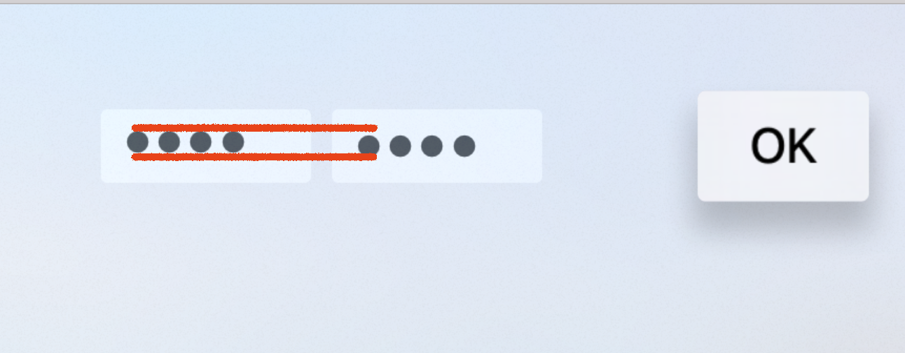

# Radar-

Project created to report bug on UITextField for tvOS

· Open radar: https://openradar.appspot.com/

# Description
When an instance of UITextField is created programatically setting the property isSecureTextEntry equal to `true`, the text is not propertly centered.

# Expected 
The text appears in the center of the UITextField, default behaviour of `contentVerticalAlignment`

# Steps

In the project attached, 2 UITextFields and 1 UIButton are created:
- UITextField, programatically created on the left side
- UITextField, created from Interface Builder on the right side
- UIButton on the right edge

1.- Navigate to those UITextFields and introduce some texts on them
2.- Move the focus to the UIButton in order to get a similar layout on both UITextFields

